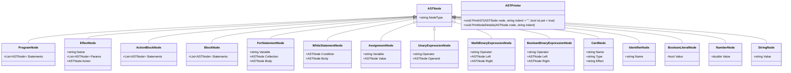

```mermaid
classDiagram
    class ASTNode {
        +string NodeType
    }
    class ProgramNode {
        +List~ASTNode~ Statements
    }
    class EffectNode {
        +string Name
        +List~ASTNode~ Params
        +ASTNode Action
    }
    class ActionBlockNode {
        +List~ASTNode~ Statements
    }
    class BlockNode {
        +List~ASTNode~ Statements
    }
    class ForStatementNode {
        +string Variable
        +ASTNode Collection
        +ASTNode Body
    }
    class WhileStatementNode {
        +ASTNode Condition
        +ASTNode Body
    }
    class AssignmentNode {
        +string Variable
        +ASTNode Value
    }
    class UnaryExpressionNode {
        +string Operator
        +ASTNode Operand
    }
    class MathBinaryExpressionNode {
        +string Operator
        +ASTNode Left
        +ASTNode Right
    }
    class BooleanBinaryExpressionNode {
        +string Operator
        +ASTNode Left
        +ASTNode Right
    }
    class CardNode {
        +string Name
        +string Type
        +string Effect
    }
    class IdentifierNode {
        +string Name
    }
    class BooleanLiteralNode {
        +bool Value
    }
    class NumberNode {
        +double Value
    }
    class StringNode {
        +string Value
    }

    ASTNode <|-- ProgramNode
    ASTNode <|-- EffectNode
    ASTNode <|-- ActionBlockNode
    ASTNode <|-- BlockNode
    ASTNode <|-- ForStatementNode
    ASTNode <|-- WhileStatementNode
    ASTNode <|-- AssignmentNode
    ASTNode <|-- UnaryExpressionNode
    ASTNode <|-- MathBinaryExpressionNode
    ASTNode <|-- BooleanBinaryExpressionNode
    ASTNode <|-- CardNode
    ASTNode <|-- IdentifierNode
    ASTNode <|-- BooleanLiteralNode
    ASTNode <|-- NumberNode
    ASTNode <|-- StringNode

    class ASTPrinter {
        +void PrintAST(ASTNode node, string indent = "", bool isLast = true)
        +void PrintNodeDetails(ASTNode node, string indent)
    }
```